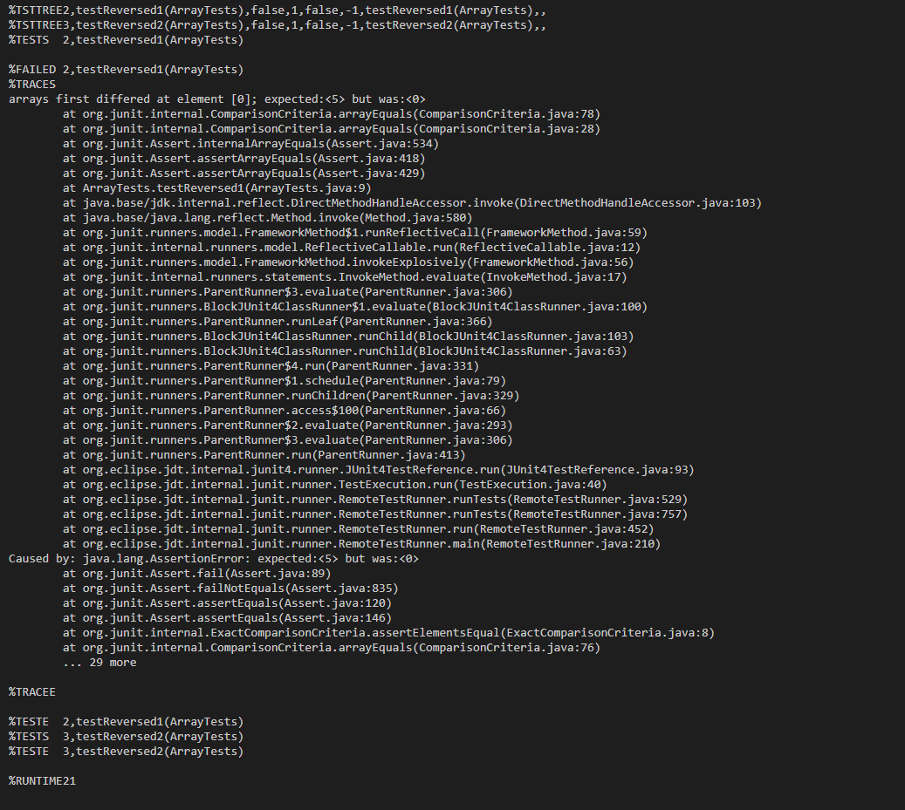

# Lab Report 3

## Part 1 Bugs
I will be looking at the bug in the `reversed(int arr[])` function

**1. A failure-inducing input for the buggy program**
```
  @Test
  public void testReversed1() {
    int[] input1 = {1, 2, 3, 4, 5};
    assertArrayEquals(new int[]{5, 4, 3, 2, 1}, ArrayExamples.reversed(input1));
  }
```

**2. An input that doesn't induce a failure**
```
  @Test
  public void testReversed2() {
    int[] input1 = { };
    assertArrayEquals(new int[]{ }, ArrayExamples.reversed(input1));
  }
```

**3. The symptom, as the output of running the two tests above**


**4. The bug, as the before-and-after code change required to fix it**

Buggy Code
```
  static int[] reversed(int[] arr) {
    int[] newArray = new int[arr.length];
    for(int i = 0; i < arr.length; i += 1) {
      arr[i] = newArray[arr.length - i - 1];
    }
    return arr;
  }
```

Fixed Code
```
  static int[] reversed(int[] arr) {
    int[] newArray = new int[arr.length];
    for(int i = 0; i < arr.length; i += 1) {
      newArray[i] = arr[arr.length - i - 1];
    }
    return newArray;
}
```

**5. Brief Description**

The code is buggy because returns the original array and does not assign values from `arr`  to `newArray`. This fix addresses these issues because `newArray` now receives values from `arr` and the function correctly returns the reversed array.

   
## Part 2 Researching Commands

For this section I used an article called Mastering grep Command: Your Complete Cheat Sheet for Efficient Text Searching in Linux, found at this link: https://medium.com/@cuncis/mastering-grep-command-your-complete-cheat-sheet-for-efficient-text-searching-in-linux-b569a573432b, as a guide to help me discover and use commands related to grep.

**1. `grep -r "Apple"`**
```
@dznielle ➜ /workspaces/docsearch (main) $ grep -r "Apple" technical/biomed
technical/biomed/1471-2202-2-5.txt:            http://rsb.info.nih.gov/nih-imageand an Apple Macintosh
technical/biomed/1471-2121-2-11.txt:          Apple Power Mac 9600.
technical/biomed/1471-2121-2-18.txt:          camera and an Apple Macintosh computer for capturing
technical/biomed/1471-2105-3-12.txt:            Moving an Apple-supplied "JAVA Accelerator for PowerPC"
technical/biomed/1472-6793-2-1.txt:            accelerated Power Mac 6100/66 computer (Apple Computer,
technical/biomed/1472-6793-2-1.txt:            7500/100 (Apple Computer, Cupertino, Ca). The system
```
```
@dznielle ➜ /workspaces/docsearch (main) $ grep -r "Apple" technical/government
technical/government/Gen_Account_Office/d01376g.txt:Dr. Lynda McDonald Applegate Professor of Business
technical/government/About_LSC/State_Planning_Report.txt:Appleseed Justice Center (formerly South Carolina Legal Services
technical/government/About_LSC/State_Planning_Report.txt:Carolina Bar, two persons from the Appleseed Justice Center, and an
technical/government/About_LSC/State_Planning_Report.txt:the South Carolina Bar and the Appleseed Justice Center. Operating
technical/government/About_LSC/State_Planning_Report.txt:Appleseed Justice Center, the South Carolina Bar Pro Bono Program,
technical/government/About_LSC/State_Planning_Report.txt:The Appleseed Justice Center coordinates training and
technical/government/Media/Coup_Reshapes_Legal_Aid.txt:Gabriel-Pomona Valley board President Jerome Applebaum said.
```

This command looks through a specified directory (and/or subdirectories) for a specified input, case sensitive, and displays the names of files that contain the input as well as the line(s) in the file that contains the input. This can be useful if someone wants to know if a file contains a specific keyword.

**2. `grep -rn "Apple"`**
```
@dznielle ➜ /workspaces/docsearch (main) $ grep -rn "Apple" technical/biomed
technical/biomed/1471-2202-2-5.txt:539:            http://rsb.info.nih.gov/nih-imageand an Apple Macintosh
technical/biomed/1471-2121-2-11.txt:750:          Apple Power Mac 9600.
technical/biomed/1471-2121-2-18.txt:512:          camera and an Apple Macintosh computer for capturing
technical/biomed/1471-2105-3-12.txt:318:            Moving an Apple-supplied "JAVA Accelerator for PowerPC"
technical/biomed/1472-6793-2-1.txt:442:            accelerated Power Mac 6100/66 computer (Apple Computer,
technical/biomed/1472-6793-2-1.txt:502:            7500/100 (Apple Computer, Cupertino, Ca). The system
```
```
@dznielle ➜ /workspaces/docsearch (main) $ grep -rn "Apple" technical/government
technical/government/Gen_Account_Office/d01376g.txt:2805:Dr. Lynda McDonald Applegate Professor of Business
technical/government/About_LSC/State_Planning_Report.txt:2410:Appleseed Justice Center (formerly South Carolina Legal Services
technical/government/About_LSC/State_Planning_Report.txt:2426:Carolina Bar, two persons from the Appleseed Justice Center, and an
technical/government/About_LSC/State_Planning_Report.txt:2436:the South Carolina Bar and the Appleseed Justice Center. Operating
technical/government/About_LSC/State_Planning_Report.txt:2446:Appleseed Justice Center, the South Carolina Bar Pro Bono Program,
technical/government/About_LSC/State_Planning_Report.txt:2502:The Appleseed Justice Center coordinates training and
technical/government/Media/Coup_Reshapes_Legal_Aid.txt:132:Gabriel-Pomona Valley board President Jerome Applebaum said.
```

This command looks through a specified directory (and/or subdirectories) for a specified input, case sensitive, and displays the names of files that contain the input as well as the line(s), with their line numbers, in the file that contains the input. This can be useful if someone wants to know if a file contains a keyword and what specific line the keyword is found.

**3. `grep -ri "apple"`**
```
@dznielle ➜ /workspaces/docsearch (main) $ grep -ri "apple" technical/biomed
technical/biomed/1471-2202-2-5.txt:            http://rsb.info.nih.gov/nih-imageand an Apple Macintosh
technical/biomed/1471-2202-2-5.txt:            computer http://www.apple.com. If the criteria for
technical/biomed/1471-2121-2-11.txt:          Apple Power Mac 9600.
technical/biomed/gb-2003-4-8-r51.txt:            visualized using QuickPDB, a Java applet developed by
technical/biomed/1471-2121-2-18.txt:          camera and an Apple Macintosh computer for capturing
technical/biomed/1471-2105-3-12.txt:            This problem appears to lie in the JAVA applet included
technical/biomed/1471-2105-3-12.txt:            Moving an Apple-supplied "JAVA Accelerator for PowerPC"
technical/biomed/1471-2105-3-12.txt:            applet-generated graph may be problematic due to an
technical/biomed/1471-2105-3-12.txt:            applet incompatibility; capturing the graph as a
technical/biomed/1472-6882-1-10.txt:          antibiotics and the ananase enzyme (from the pineapple 
technical/biomed/1472-6793-2-1.txt:            accelerated Power Mac 6100/66 computer (Apple Computer,
technical/biomed/1472-6793-2-1.txt:            7500/100 (Apple Computer, Cupertino, Ca). The system
technical/biomed/gb-2002-3-10-research0053.txt:          in pineapple (~70% to 
technical/biomed/1471-2458-3-11.txt:        fresh-pressed apple cider [ 28 ] . Other foodborne
technical/biomed/gb-2002-3-12-research0077.txt:          the JAVA applet WebMol [ 35]. In this setting, the color
technical/biomed/1468-6708-3-10.txt:        questions requiring large sample sizes and to grapple with
```
```
@dznielle ➜ /workspaces/docsearch (main) $ grep -ri "apple" technical/government
technical/government/Gen_Account_Office/Testimony_cg00010t.txt:Clearly, much has already changed as GAO has grappled with this
technical/government/Gen_Account_Office/Testimony_cg00010t.txt:grapples with increasingly complex and contentious issues requiring
technical/government/Gen_Account_Office/d01376g.txt:Dr. Lynda McDonald Applegate Professor of Business
technical/government/Gen_Account_Office/Oct15-2001_d0224.txt:incidents has proven to be challenging as organizations grapple
technical/government/About_LSC/State_Planning_Report.txt:Appleseed Justice Center (formerly South Carolina Legal Services
technical/government/About_LSC/State_Planning_Report.txt:Carolina Bar, two persons from the Appleseed Justice Center, and an
technical/government/About_LSC/State_Planning_Report.txt:the South Carolina Bar and the Appleseed Justice Center. Operating
technical/government/About_LSC/State_Planning_Report.txt:Appleseed Justice Center, the South Carolina Bar Pro Bono Program,
technical/government/About_LSC/State_Planning_Report.txt:The Appleseed Justice Center coordinates training and
technical/government/About_LSC/commission_report.txt:apples (4,428), vegetable harvesting (4,822), and fruit harvesting
technical/government/About_LSC/commission_report.txt:the October apple harvest, and then return to Mexico until the work
technical/government/About_LSC/commission_report.txt:apple harvest. See April Comments at 101 (comment of Garry G.
technical/government/Media/Law_Schools.txt:government post. Here is how to grapple "in the service of
technical/government/Media/Coup_Reshapes_Legal_Aid.txt:Gabriel-Pomona Valley board President Jerome Applebaum said.
```
This command looks through a specified directory (and/or subdirectories) for a specified input, non case sensitive, and displays the names of files that contain the input as well as the line(s) in the file that contains the input. This can be useful if someone is not concerned with the case of their input and want to find the files that contain their input.


**4. `grep -rl "apple"`**
```
@dznielle ➜ /workspaces/docsearch (main) $ grep -rl "apple" technical/biomed
technical/biomed/1471-2202-2-5.txt
technical/biomed/gb-2003-4-8-r51.txt
technical/biomed/1471-2105-3-12.txt
technical/biomed/1472-6882-1-10.txt
technical/biomed/gb-2002-3-10-research0053.txt
technical/biomed/1471-2458-3-11.txt
technical/biomed/gb-2002-3-12-research0077.txt
technical/biomed/1468-6708-3-10.txt
```
```
@dznielle ➜ /workspaces/docsearch (main) $ grep -rl "apple" technical/government
technical/government/Gen_Account_Office/Testimony_cg00010t.txt
technical/government/Gen_Account_Office/Oct15-2001_d0224.txt
technical/government/About_LSC/commission_report.txt
technical/government/Media/Law_Schools.txt
```
This command looks through a specified directory (and/or subdirectories) for a specified input and displays the names of the files that contain the input. This can be useful to someone who is not concerned with the content of the file itself, rather just if a file contains a specified input.


